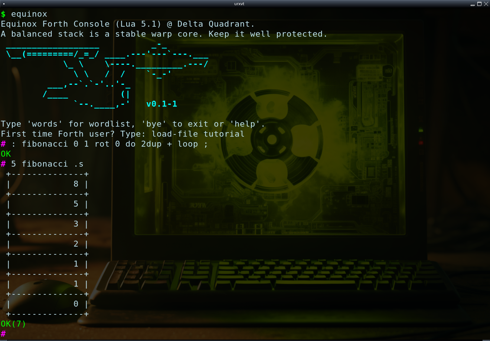

## Equinox - Forth Programming Language That Targets Lua 🌑

```forth
 _____            _                   _____          _   _     
| ____|__ _ _   _(_)_ __   _____  __ |  ___|__  _ __| |_| |__  
|  _| / _` | | | | | '_ \ / _ \ \/ / | |_ / _ \| '__| __| '_ \ 
| |__| (_| | |_| | | | | | (_) >  <  |  _| (_) | |  | |_| | | |
|_____\__, |\__,_|_|_| |_|\___/_/\_\ |_|  \___/|_|   \__|_| |_|
         |_|

: fibonacci 0 1 rot 0 do 2dup + loop ;

10 fibonacci .s
```

### 🌕 Design goals

* Compiles directly to (optimized) Lua source code.
* Modeless with no interpretation mode.
* Uses Lua call semantics, no return stack.
* Lua table and array support.
* Fixes Lua's accidental global problem.
* GameDev support via [Love2D](https://love2d.org/) and [TIC-80](https://tic80.com/) (later).
* Self-hosted compiler (eventually).

# 🚀 Install

```bash
$ luarocks install equinox
```

The easiest way to install Equinox is by using Lua's package manager, [Luarocks](https://luarocks.org/).

Equinox requires Lua 5.1 or later.

#### Start the REPL

```bash
$ equinox
```




If you're a first-time Forth user, I suggest you start with the built-in tutorial.

In the REPL, type:

```
load-file tutorial
```

#### Compile and execute a file:

```bash
$ equinox file.eqx
```

### Why Equinox?

Popular retro gaming platforms like the TIC-80 tiny computer and 2D game engines like Love2D usually use Lua for scripting. While Lua's a cool, lightweight language, it doesn’t quite give you that old-school game dev vibe. Forth, on the other hand, really brings back the golden age of gaming with that nostalgic feel.

Lua has some questionable semantics, like how a simple typo can accidentally create a global variable when you wanted to modify a local one. Equinox fixes this problem by preventing accidental creation of globals.

Unlike Lua, Equinox syntactically distinguishes between sequential tables `[]` and hash maps `{}`. While the underlying data structure is the same, this differentiation helps make the code easier to read, in my opinion.

### Why Not Equinox?

Equinox is a Forth that uses postfix notation and a stack to manage the parameters of words. This is quite different from how mainstream programming languages work and look. Some people might find this style unusual or hard to read. 

While I believe Forth helps make people better programmers by teaching them to break down definitions into small, manageable pieces, I’m fully aware it’s not for everyone.

Equinox is generally slower than Lua, mainly due to the stack operations. While the compiler uses various optimization techniques to minimize these operations, the end result is often slower compared to a pure Lua counterpart.

..
..
..
..

#### Lua table operations

| Operation       | Array                       | Table                               |
|-----------------|-----------------------------|-------------------------------------|
| Create          | [ 1 2 3 ]                   | { key1 val1 }                       |
| Append          | tbl item append             |                                     |
| Insert new      | tbl idx item insert         | value -> tbl.key or tbl key value ! |
| Overwrite       | tbl idx item !              | value -> tbl.key or tbl key value ! |
| Lookup          | tbl idx @                   | tbl.key or tbl key @                |
| Remove          | tbl idx remove              | tbl key nil !                       |
| Remove & Return | tbl idx #( table.remove 2 ) |                                     |
| Size            | tbl size                    |                                     |

#### Lua interop

| Operation                                          | Syntax                      |
|----------------------------------------------------|-----------------------------|
| Call Lua function (2 parameters)                   | 2 8 #( math.pow 2 )         |
| Call nullary Lua function (no parameters)          | #( os.time )                |
| Call Lua (binary) function and ignore return value | tbl 2 #( table.remove 2 0 ) |
| Call Lua (unary) method                            | #( astr:sub 1 )             |
| Property lookup                                    | math.pi                     |
|                                                    |                             |

 
